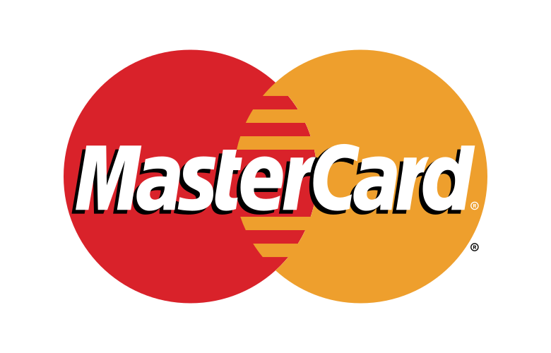
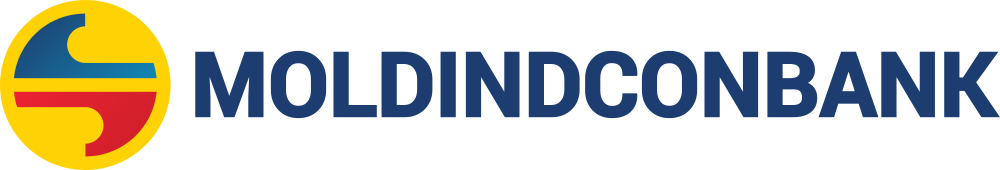

# Partiale — Renée

Ce se repetă pe pagini și **de unde se ia**. Actualizat 17 sept. 2026.

Site-ul e static, fără build. Există două mecanisme diferite — nu le confunda:

| Mecanism | Ce acoperă | Cum se modifică |
|---|---|---|
| **Copy-paste**, documentat aici | header, footer, `<head>` | schimbi aici **și** în toate cele 13 pagini |
| **Injectat din JS**, sursă unică | modalul de rezervare, lightbox-ul de galerie | schimbi într-un singur loc |

Cele 14 pagini: `index` · `meniu` · `produs` · `cos` · `checkout` · `comanda-confirmata` · `despre` · `contact` · `evenimente` · `catering` · `blog` · `articol` · `termeni` · `confidentialitate`

---

## 1. Modalul de rezervare — NU se copiază

Trăiește în **`js/rez-modal.js`** și se injectează singur în `document.body`.

```html
<script src="js/rez-modal.js"></script>   <!-- OBLIGATORIU înainte de js/main.js -->
```

`js/main.js` caută `#rezModal` la inițializare; dacă scriptul rulează după, modalul nu se leagă și butonul „Rezervări" nu face nimic. Asta s-a și întâmplat până pe 10 sept. 2026, când modalul era scris direct în `index.html` — butonul exista în header-ul tuturor paginilor, dar funcționa doar pe home.

Conține trei pickere: `#pickPers`, `#pickLoc` și `#pickCand` (dată + oră comasate).

**WP:** → `get_template_part('template-parts/modal-rezervare')`

## 2. Lightbox-ul de galerie — parțial copiat

Markup-ul containerului (`#lightbox`) e copiat în cele 3 pagini cu galerie: `index`, `despre`, `evenimente`. Logica e în `js/main.js` și se leagă singură de orice element cu `data-lightbox`.

Un element de galerie arată așa:

```html
<button type="button" class="g-item g-1 reveal" data-lightbox aria-label="Mărește: TEXT ALT">
  
  <span class="g-veil" aria-hidden="true"><span class="g-zoom"></span></span>
</button>
```

## 2.1–2.2 Pattern-ul — ŞTERS

Banda decorativă verticală şi delimitatorul full-width cu pattern **nu mai există**.
Scoase 16 sept. 2026 la cererea clientului: „acel patern nu-l mai folosim pe site".

Au dispărut `.patern-banda`, `.patern-separator`, `@keyframes paternGlisare` şi
IntersectionObserver-ul din `js/main.js`. Fişierele `img/patern*.svg` au rămas în repo,
dar nu sunt referite de nimic. **Nu le readuce** — au fost scoase intenţionat.

## 2.3 Switcher de limbă — DOAR PREZENTARE

În header, după coșul de cumpărături, pe toate cele 13 pagini:

```html
<div class="lang" role="group" aria-label="Limbă">
  <button type="button" class="lang-opt is-current" data-lang="ro" aria-current="true">RO</button>
  <button type="button" class="lang-opt" data-lang="ru">RU</button>
  <button type="button" class="lang-opt" data-lang="en">EN</button>
</div>
```

⚠️ **Nu navighează nicăieri.** `js/main.js` doar comută starea activă, ca să se vadă cum arată. Structura multilingvă și traducerile se fac în WordPress — decizia lui Sergiu, 14 sept. 2026: nu construim subdirectoare `/ru/`, `/en/` în prototipul static.

**WP:** → `pll_the_languages()` (Polylang) sau switcher-ul WPML, care generează linkurile reale.

Sunt `<button>`, nu `<a>` — tocmai fiindcă nu duc nicăieri. Consecință: regulile de culoare ale header-ului (`header:not(.scrolled) … a`, `nav.open a`, `body.subpage … a`) au trebuit extinse să includă `.lang-opt`, altfel rămâneau închise peste video-ul din hero.

## 3. `<head>` — fonturi

Identic pe toate cele 13 pagini, imediat după `<meta name="description">`:

```html
<link rel="preload" href="fonts/cormorant-400-latin.woff2" as="font" type="font/woff2" crossorigin>
<link rel="preload" href="fonts/opensans-300-latin.woff2" as="font" type="font/woff2" crossorigin>
<link rel="stylesheet" href="css/fonts.css">
<link rel="stylesheet" href="css/main.css">
<link rel="stylesheet" href="css/shop.css">
```

Fonturile sunt self-hostate. **Nu readuce `<link>` către Google Fonts** — vezi `CLAUDE.md` §5.

⚠️ **`despre.html` nu încarcă `shop.css`** — singura abatere rămasă. `evenimente.html` îl încarcă din 17 sept. 2026, fiindcă teaser-ul de catering foloseşte clasele `.cat-*` din `shop.css`.

## 4. Header

Trei zone: **logo · nav · acțiuni**. Nav-ul ține doar linkurile de pagină; `Rezervări`, coșul, switcher-ul de limbă și hamburgerul stau în `.header-actions` și **rămân vizibile pe mobil**, când nav-ul se ascunde.

**Pragul e 900px**, nu 640: la 768 (iPad portret) nav-ul nu mai încape lângă logo.

Hamburgerul e o iconiță din trei linii care se transformă în X prin clasa `.open`. `setMenu()` din `js/main.js` comută clasa — **nu scrie `textContent` pe buton**, ar șterge span-ul `.burger-ico`.

Logo-ul e SVG inline, ca `currentColor` să-i schimbe culoarea la scroll. Sursa: `img/logo_simple.svg`.

**Butonul de rezervare** are iconiţă + etichetă; sub 560px rămâne doar iconiţa, într-un buton pătrat de 42px, ca şi coşul. Nu se ascunde niciodată — e CTA-ul principal.

⚠️ **Animaţiile de intrare folosesc `backwards`, nu `forwards`, şi nu pun `opacity:0` în starea de bază.** Cu `opacity:0` în bază, orice situaţie în care animaţia nu rulează — `prefers-reduced-motion`, browser vechi, eroare — lasă elementul **invizibil permanent**. Cu `backwards`, starea iniţială se aplică doar cât ţine animaţia; dacă animaţia lipseşte, elementul e vizibil normal. Vezi itemii din meniul mobil.

⚠️ **`.scroll-hint` NU se centrează cu `translateX(-50%)`.** Animaţia `fadeUp` se termină cu `transform:none` şi, având `forwards`, anulează corecţia — elementul rămâne deplasat cu jumătate din lăţimea lui. Centrarea se face prin `left:0;right:0;margin-inline:auto;width:fit-content`. Acelaşi lucru e valabil pentru orice element centrat prin transform care primeşte şi o animaţie.

```html
<!-- WP: header.php -->
<header id="header">
  <a class="logo" href="index.html#top"><!-- conținutul din img/logo_simple.svg, inline --><span class="sr-only">Renée</span></a>
  <nav id="nav">
    <a href="despre.html">Despre</a>
    <a href="meniu.html">Meniu</a>
    <!-- singurul dropdown din nav — vezi §4.1 -->
    <div class="nav-item">
      <a href="evenimente.html">Evenimente</a>
      <ul class="nav-sub">
        <li><a href="catering.html">Catering</a></li>
      </ul>
    </div>
    <a href="blog.html">Blog</a>
    <a href="contact.html">Contact</a>
    <div class="nav-social">
      <a href="https://www.instagram.com/renee_brunch/" target="_blank" rel="noopener">Instagram</a>
      <a href="https://www.facebook.com/renee.brunch" target="_blank" rel="noopener">Facebook</a>
      <a href="https://www.tiktok.com/@renee_brunch" target="_blank" rel="noopener">TikTok</a>
    </div>
  </nav>
  <div class="header-actions">
    <a class="btn-rez" href="index.html#vizita" data-rez>Rezervări</a>
    <a class="cart-link" href="cos.html" aria-label="Coș">
      <!-- iconiță coș, SVG inline --><span class="cart-count" id="cartCount">0</span>
    </a>
    <!-- Switcher de limbă — DOAR PREZENTARE. Vezi PARTIALS.md §2.3. -->
    <div class="lang">
      <button type="button" class="lang-toggle" aria-haspopup="listbox" aria-expanded="false">
        <span class="lang-curent">RO</span><i class="lang-chev" aria-hidden="true"></i>
      </button>
      <ul class="lang-list" role="listbox" aria-label="Limbă">
        <li role="option" aria-selected="true" data-lang="ro">RO</li>
        <li role="option" aria-selected="false" data-lang="ru">RU</li>
        <li role="option" aria-selected="false" data-lang="en">EN</li>
      </ul>
    </div>
    <button class="burger" id="burger" aria-label="Deschide meniul" aria-expanded="false">
      <span class="burger-ico" aria-hidden="true"></span>
    </button>
  </div>
</header>
<!-- /WP: header.php -->
```

### 4.1 Dropdown-ul Evenimente → Catering

Singurul submeniu din nav, adăugat 17 sept. 2026. `.nav-item` e un `div` care ţine linkul părinte
şi lista `.nav-sub`. Se deschide la **hover** şi la **`:focus-within`** (tastatură) — fără JS,
fără buton de toggle. Sub 900px, în overlay, e **mereu desfăşurat** ca linie mai mică sub Evenimente.

Trei lucruri care nu se văd din markup:
- **Culoarea textului din dropdown e mereu ink**, şi peste hero-ul închis de pe home, fiindcă fundalul
  cutiei e mereu crem. Regula are un `li` în selector doar pentru specificitate — altfel o bate
  `header:not(.scrolled) nav:not(.open) a`, care e mai jos în fişier. Nu-l scoate.
- **Animaţia din meniul mobil** numără cu `nth-of-type` doar `<a>`-urile directe. `.nav-item` fiind
  `div`, primeşte propriul delay (al treilea); Blog şi Contact au devenit `nth-of-type(3)` şi `(4)`.
- **Starea activă:** `js/main.js` marchează linkurile după fişier **şi** după părinte
  (`catering.html` → `evenimente.html`), deci pe catering se aprind amândouă. Selectorul e `#nav a`,
  nu `#nav > a` — cu `>` Evenimente nu mai era găsit.

**WP:** `wp_nav_menu` cu `depth => 2`; walker-ul trebuie să scoată exact `div.nav-item > a + ul.nav-sub`.


## 5. Footer

Linkurile legale stau în `footer-bottom`, nu în coloana de navigare.

```html
<!-- WP: footer.php -->
<footer>
  <div class="wrap">
    <div class="footer-top">
      <div class="footer-col footer-brand">
        <a href="index.html" class="footer-logo"><!-- conținutul din img/logo.svg, inline --><span class="sr-only">Renée</span></a>
        <p class="footer-tagline">Cafenea &amp; all day breakfast în Chișinău. O nouă emoție, un nou început.</p>
        <div class="footer-social">
          <a href="https://www.instagram.com/renee_brunch/" target="_blank" rel="noopener">Instagram</a>
          <a href="https://www.facebook.com/renee.brunch" target="_blank" rel="noopener">Facebook</a>
          <a href="https://www.tiktok.com/@renee_brunch" target="_blank" rel="noopener">TikTok</a>
        </div>
        <!-- Metode de plată.
             Toate trei sunt logo-uri oficiale din img/ (visa.svg, mastercard.svg,
             moldindconbank_logo.svg). A nu se redesena sau recolora — fiecare brand
             are ghid propriu care interzice variantele modificate. -->
        <div class="footer-plata">
          <span class="plata-titlu">Metode de plată</span>
          <div class="plata-logos">
            <span class="plata-logo plata-visa"></span>
            <span class="plata-logo plata-mc"></span>
            <span class="plata-logo plata-micb"></span>
          </div>
        </div>
      </div>
      <div class="footer-col">
        <h4>Explorează</h4>
        <nav class="footer-links">
          <a href="index.html">Acasă</a>
          <a href="meniu.html">Meniu</a>
          <a href="despre.html">Despre</a>
          <a href="evenimente.html">Evenimente</a>
          <a href="catering.html">Catering</a>
          <a href="blog.html">Blog</a>
          <a href="contact.html">Contact</a>
        </nav>
      </div>
      <div class="footer-col footer-info">
        <h4>Vino la noi</h4>
        <p><span class="fi-label">Renée</span>Oasis Mall, str. Bogdan-Voievod 1, Chișinău</p>
        <p><span class="fi-label">Renée Urban</span>bd. Ștefan cel Mare și Sfânt 115/1, Chișinău</p>
        <p><span class="fi-label">Program</span>Zilnic 08:00 – 22:00 <!-- DRAFT --></p>
        <a href="tel:+37360000000">+373 60 000 000 <!-- DRAFT: telefon de confirmat --></a>
      </div>
    </div>
    <div class="footer-bottom">
      <span class="footer-meta">© 2026 Renée · Chișinău</span>
      <div class="footer-meta">
        <a href="termeni.html">Termeni și condiții</a>
        |
        <a href="confidentialitate.html">Politică de confidențialitate</a>
      </div>
      <span class="footer-meta">Toate drepturile rezervate</span>
    </div>
  </div>
</footer>
<!-- /WP: footer.php -->
```

### Metodele de plată — de ce sunt `` şi nu SVG inline

Singurul loc din proiect unde un SVG **nu** se pune inline. Logo-urile sunt ale altor branduri: nu se recolorează, nu se redesenează, nu primesc `currentColor`.

Chip-ul crem există pentru contrast — marcajele sunt în culorile lor de brand şi nu s-ar vedea pe footer-ul închis.

Visa şi Mastercard au padding propriu în fişier (caseta standard `780×500`), deci chip-ul lor are `padding:0` şi imaginea umple cardul. Moldindconbank e wordmark simplu (`1000×171`) şi păstrează padding. Dacă le pui la aceeaşi înălţime de imagine, arată dezechilibrat — valorile din `main.css` sunt calibrate optic, nu matematic.

Detalii complete în `CLAUDE.md` §5, „Logo-uri terţe".

## 5.1 Elementul activ din meniu — NU se marchează manual

`js/main.js` adaugă singur `class="is-current"` şi `aria-current="page"` pe linkul care corespunde paginii curente. Nu pune nimic în HTML.

Subpaginile moştenesc părintele: `produs`, `cos`, `checkout`, `comanda-confirmata` → **Meniu** · `articol` → **Blog**.
`index`, `termeni` şi `confidentialitate` nu au element în meniu, deci nu se activează nimic — e corect.

Butonul „Rezervări" şi „Coş" sunt excluse din selector: primul are `href="index.html#vizita"` şi s-ar activa pe home.

## 5.2 Reguli de scalare — cum rămâne proporţional

Trei convenţii, stabilite la adaptarea pentru mobil (14 sept. 2026). Dacă le încalci, mobilul se strică fără să se vadă pe desktop.

**1. Spaţierile folosesc `vw`, nu `vh`.** Pe un telefon înalt, `20vh` devine 162px de padding — proporţional cu ecranul, dar nu cu lăţimea, care e ce contează. Toate cele 26 de paddinguri au fost convertite.

```css
padding: clamp(104px, 12.5vw, 210px);   /* nu 20vh */
```

**2. Minimul din `clamp` e valoarea de mobil, nu una de siguranţă.** La 375px, `6vw` înseamnă 22px — deci clamp-ul cade mereu pe minim. Dacă minimul e calibrat pentru desktop, mobilul rămâne supradimensionat. Regula: alege minimul pentru 375px, apoi creşte coeficientul `vw` până când valoarea de la 1440px revine unde era.

| | Înainte | După | 375px | 1440px |
|---|---|---|---|---|
| `.h2` | `clamp(44px,6vw,84px)` | `clamp(30px,7.4vw,84px)` | 44 → **30** | 84 → 84 |
| `.manifest` | `clamp(28px,3.4vw,44px)` | `clamp(21px,4.4vw,44px)` | 28 → **21** | 44 → 44 |

**3. Titlurile îşi pun propriul `line-height`.** `body` are 1.6; un titlu care îl moşteneşte capătă 38px între rânduri la 24px font. Există `h1,h2,h3,h4{line-height:1.22}` global, dar orice titlu de tip display trebuie să-şi pună valoarea lui, mai strânsă.

**Ţinte de atingere:** minim 44px pe mobil, crescute prin `padding`, nu prin `font-size` — vezi blocul „MOBIL — zone de atingere" din `main.css`.

## 6. Scripturi, în ordine, înainte de `</body>`

Pagini cu magazin/coș (`index`, `meniu`, `produs`, `cos`, `checkout`, `comanda-confirmata`):

```html
<script src="data/products.js"></script>
<script src="js/cart.js"></script>
<script src="js/shop.js"></script>
<script src="js/rez-modal.js"></script>
<script src="js/main.js"></script>
```

Pagini fără magazin (dar cu badge de coș în header):

```html
<script src="js/cart.js"></script>
<script src="js/rez-modal.js"></script>
<script src="js/main.js"></script>
```

`js/contact.js` se adaugă **doar** pe `contact.html`.

Pagini cu catering (`catering`, `evenimente`) — catalogul separat, fără coş:

```html
<script src="data/catering.js"></script>
<script src="js/cart.js"></script>
<script src="js/catering.js"></script>
<script src="js/rez-modal.js"></script>
<script src="js/main.js"></script>
<script>
  Catering.mount({ gridId:'catGrid', filtersId:'catFilters', countId:'catCount', descId:'catDesc' });   // catering.html
  Catering.mountTeaser({ gridId:'cateringTeaser', ids:[ /* 4 id-uri din data/catering.js */ ] });    // evenimente.html
</script>
```
